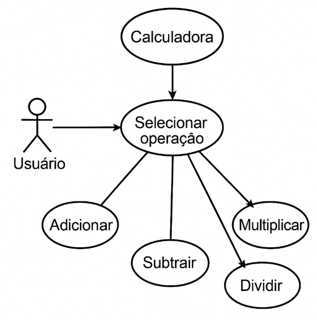
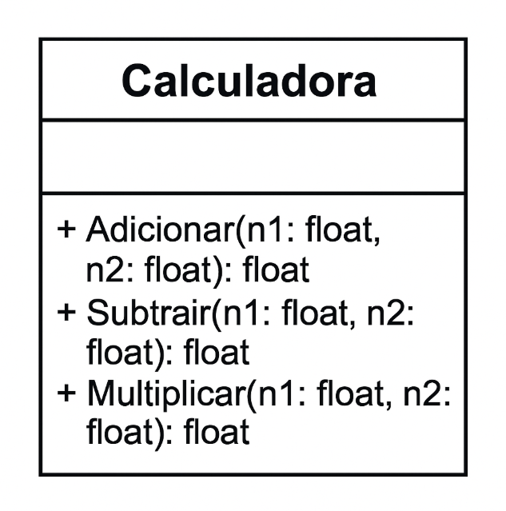

Calculadora Simples em Python
Este projeto consiste em uma calculadora simples desenvolvida em Python, capaz de realizar as quatro operações aritméticas básicas: adição, subtração, multiplicação e divisão. O objetivo é demonstrar o uso de estruturas condicionais, tratamento de entrada do usuário e manipulação de tipos de dados em Python.

Como a Calculadora Funciona
A calculadora interage com o usuário através do terminal. Ao iniciar o programa, o usuário é apresentado a um menu com as opções de operação:

Adição

Subtração

Multiplicação

Divisão

Após selecionar uma opção (digitando o número correspondente), o programa solicita que o usuário insira dois números. A calculadora então realiza a operação escolhida com os números fornecidos e exibe o resultado.

Tratamento de Erros
O programa inclui tratamento de erros para garantir uma experiência mais robusta:

Entrada Inválida: Se o usuário digitar caracteres não numéricos ao invés de números, ou uma opção de operação inválida, o programa exibirá uma mensagem de erro.

Divisão por Zero: Em caso de tentativa de divisão por zero, uma mensagem de erro específica será exibida, impedindo que o programa trave.

Histórico de Commits
Abaixo está um resumo dos principais commits que marcaram o desenvolvimento desta calculadora:

Implementação da Adição: Adicionada a funcionalidade para somar dois números.

Implementação da Subtração: Incluída a capacidade de subtrair um número do outro.

Implementação da Multiplicação: Desenvolvida a função para multiplicar dois números.

Implementação da Divisão: Adicionada a funcionalidade de divisão, incluindo o tratamento para divisão por zero.

Adição de Testes (Pytest): Introdução de testes unitários usando o framework pytest para garantir a correção das operações e a robustez do código.

✅ Requisitos Funcionais
O sistema deve permitir que o usuário selecione uma operação matemática: adição, subtração, multiplicação ou divisão.

O sistema deve solicitar dois números ao usuário para realizar a operação selecionada.

O sistema deve calcular e exibir o resultado da operação matemática selecionada.

O sistema deve exibir mensagens de erro em casos de:

divisão por zero,

opção inválida,

entrada inválida (como letras no lugar de números).

✅ Requisitos Não Funcionais
O sistema deve ser fácil de usar, com uma interface de texto clara e intuitiva.

O sistema deve responder rapidamente às entradas do usuário e processar as operações em tempo hábil.

O sistema deve ser executado em ambiente de linha de comando, sem necessidade de interface gráfica.

O código deve ser estruturado de forma legível e com tratamento de exceções para evitar falhas inesperadas.

Modelagem UML

Diagrama de classe

