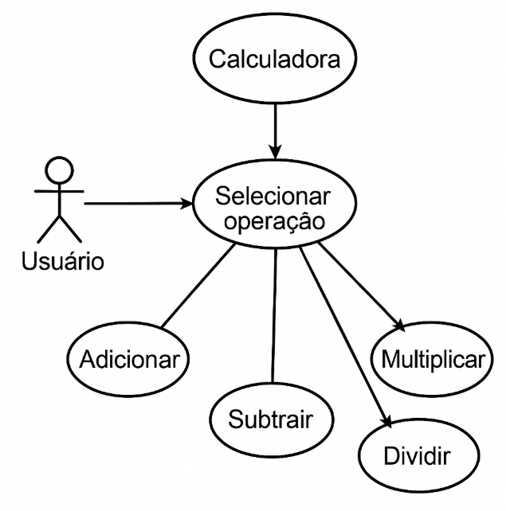
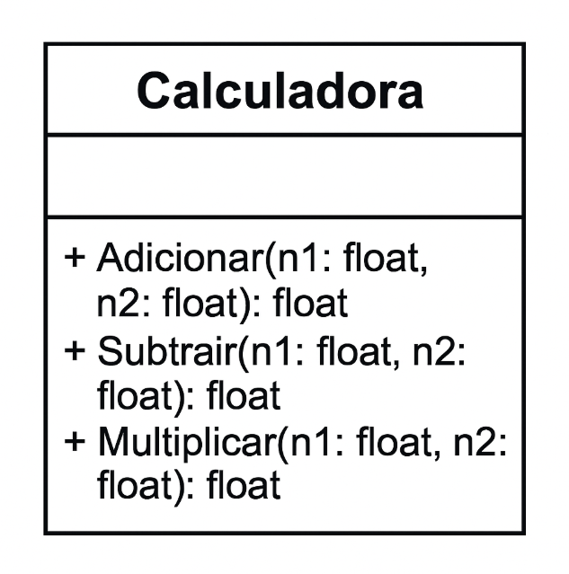

🧮 Calculadora Simples em Python
Bem-vindo ao projeto da Calculadora Simples em Python! Este repositório contém uma aplicação de linha de comando que realiza as quatro operações aritméticas básicas. Desenvolvido com foco na clareza do código e no tratamento de erros, é um excelente exemplo de como construir ferramentas interativas em Python.

🎯 Objetivo e Escopo
O principal objetivo deste projeto é fornecer uma calculadora funcional e intuitiva via terminal, demonstrando o uso eficaz de:

Estruturas Condicionais: Para direcionar o fluxo do programa com base na escolha do usuário.

Tratamento de Entrada: Para garantir que os dados inseridos pelo usuário sejam válidos.

Manipulação de Tipos de Dados: Para realizar operações matemáticas precisas.

Tratamento de Exceções: Para lidar com cenários inesperados, como divisão por zero ou entradas inválidas...

🚀 Como a Calculadora Funciona
A calculadora é operada de forma interativa através do seu terminal. Siga os passos abaixo para utilizá-la:

Início: Ao executar o programa, você será saudado com um menu de opções.

Seleção de Operação: Escolha a operação desejada (adição, subtração, multiplicação ou divisão) digitando o número correspondente.

Entrada de Números: Em seguida, insira os dois números nos quais a operação será realizada.

Resultado: A calculadora processará sua entrada e exibirá o resultado da operação.

🛡️ Tratamento de Erros
A robustez é uma prioridade! A calculadora possui mecanismos de tratamento de erros para garantir uma experiência suave:

Entrada Inválida: Se você digitar algo que não seja um número ou uma opção de menu válida, uma mensagem de erro amigável será exibida.

Divisão por Zero: Tentativas de divisão por zero são detectadas e tratadas elegantemente, evitando travamentos e informando o usuário sobre a impossibilidade da operação.

⚙️ Instruções de Execução
Para rodar a calculadora em seu ambiente local, siga estes passos simples:

Clone o Repositório:

git clone https://github.com/Milleny-pin/Software_engeering

Instale as Dependências:
Este projeto usa pytest para testes. As dependências estão listadas no arquivo requirements.txt. Para instalá-las, execute:

pip install -r requirements.txt

Execute a Calculadora:

python sua_calculadora.py

(Substitua sua_calculadora.py pelo nome do seu arquivo principal da calculadora.)

Execute os Testes:
Para verificar a integridade do código, execute os testes:

pytest

📋 Requisitos do Projeto
✅ Requisitos Funcionais
O sistema deve permitir que o usuário selecione uma operação matemática: adição, subtração, multiplicação ou divisão.

O sistema deve solicitar dois números ao usuário para realizar a operação selecionada.

O sistema deve calcular e exibir o resultado da operação matemática selecionada.

O sistema deve exibir mensagens de erro em casos de:

divisão por zero,

opção inválida,

entrada inválida (como letras no lugar de números).

🚀 Requisitos Não Funcionais
Usabilidade: O sistema deve ser fácil de usar, com uma interface de texto clara e intuitiva.

Desempenho: O sistema deve responder rapidamente às entradas do usuário e processar as operações em tempo hábil.

Portabilidade: O sistema deve ser executado em ambiente de linha de comando, sem necessidade de interface gráfica.

Manutenibilidade: O código deve ser estruturado de forma legível e com tratamento de exceções para evitar falhas inesperadas.

🗓️ Metodologia
Este projeto foi desenvolvido utilizando a metodologia Kanban, focando na visualização do fluxo de trabalho, limitação do trabalho em progresso e otimização da entrega contínua. As tarefas foram gerenciadas visualmente, permitindo flexibilidade e resposta rápida a mudanças.

📜 Histórico de Commits
A jornada de desenvolvimento desta calculadora foi registrada através dos seguintes commits principais:

Implementação da Adição: Adicionada a funcionalidade para somar dois números.

Implementação da Subtração: Incluída a capacidade de subtrair um número do outro.

Implementação da Multiplicação: Desenvolvida a função para multiplicar dois números.

Implementação da Divisão: Adicionada a funcionalidade de divisão, incluindo o tratamento para divisão por zero.

Adição de Testes (Pytest): Introdução de testes unitários usando o framework pytest para garantir a correção das operações e a robustez do código.

Implementação do Diagrama de Classe e Modelagem UML: Adição da documentação visual do projeto.

Implementação do workflows (GitActions): Configuração da integração contínua para automação de testes.

📊 Modelagem UML e Diagrama de Classe
Para uma compreensão mais profunda da arquitetura do sistema, foram criados os seguintes diagramas:

Modelagem UML

Diagrama de classe

